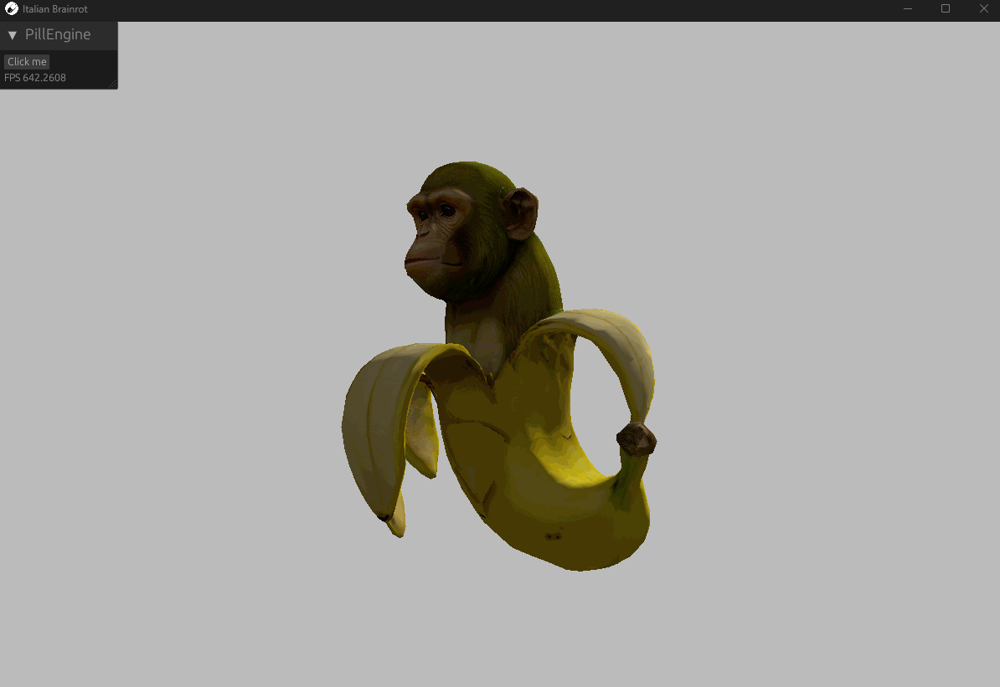

  <picture>
    <source media="(prefers-color-scheme: dark)" srcset="media/logo/pill_logo_horizontal_white.png">
    
  </picture>

Modern, free and performance-first game engine.  
Built for developers who refuse to compromise, Pill that delivers the raw speed and creative freedom needed to bring even the wildest ideas to life.
Designed from the ground up to empower both teams and solo creators, it simplifies the complex while unlocking performance far beyond traditional engines.

**For more info please visit: [PillEngine.org](https://pillengine.org)**

## Getting Started

For detailed instructions visit Pill Guide's [getting started page](https://pillengine.org/guide).

## Showcase

  

  

## Documentation
- [Pill Guide](https://pillengine.org/guide)
- [API documentation for engine users](https://raw.githack.com/MattSzymonski/Pill-Engine-Docs/main/docs/game_dev/doc/pill_engine/game/index.html "Docs")  
- [API documentation for engine developers](https://raw.githack.com/MattSzymonski/Pill-Engine-Docs/main/docs/engine_dev/doc/pill_engine/index.html "Docs")

  

